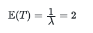
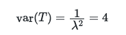

# Changing the service time distribution

Now that you have a better understanding of how queuing tool works lets turn to the problem that you are given in the assignment.  In the statement of the problem you are told that:

> The amount of time it takes to prepare a cup of tea is a random variable with an expectation of 2 minutes and a variance of 1 minutes squared

In my attempt at the modelling exercise I model the time to make a cup of tea, T, as an exponential random variable with a lambda parameter of 0.5.  The expectation for the service time is thus:

in accordance with the statement above.  However, the variance is:

which is considerably larger than the variance that is given in the statement of the problem.

__Your task in this exercise is thus to modify the code that I have written in `main.py` for simulating the queue for people getting a cup of tea.__  I want you to make it so that the distribution of service time for customers has an expectation of 2 minutes and a variance of 1 minute squared in accordance with the information in the statement of the problem.  You cannot get the correct value for the variance if the distribution of service times is exponential.  You will thus need to change the type of random variable that is used to generate the service times in order to solve this problem. 
